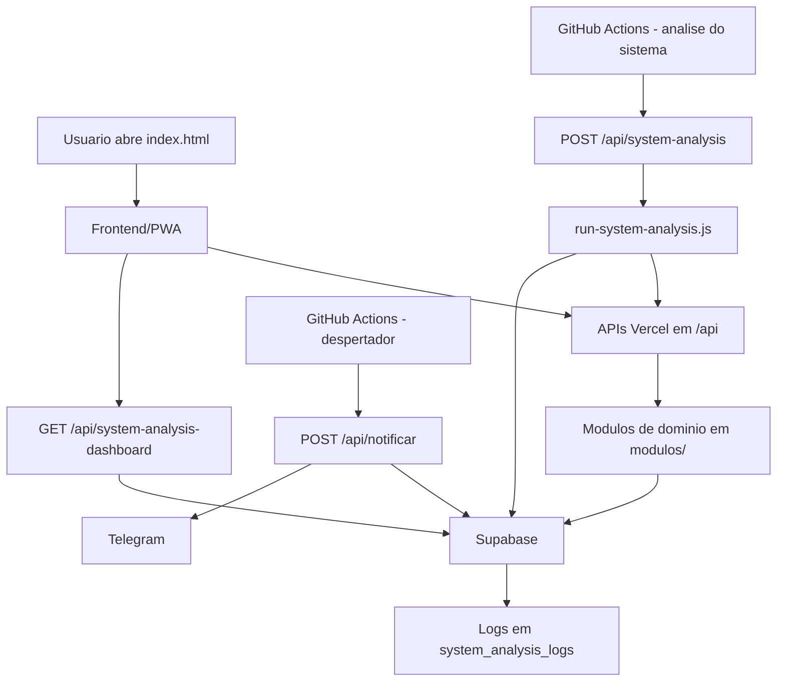

# Super App

Super App e uma aplicacao web estatica/PWA publicada na Vercel, com backend em funcoes serverless Node.js, persistencia no Supabase e automacoes agendadas pelo GitHub Actions para notificacoes e analise operacional.

## Visao Geral

- Frontend unico em [`index.html`](/c:/super%20app/super-app-1/index.html) que consome APIs em [`api/`](/c:/super%20app/super-app-1/api).
- Dominio organizado por modulos em [`modulos/`](/c:/super%20app/super-app-1/modulos).
- Persistencia centralizada no Supabase via [`lib/supabase.js`](/c:/super%20app/super-app-1/lib/supabase.js).
- Monitoramento tecnico em [`monitoring/system-analysis/run-system-analysis.js`](/c:/super%20app/super-app-1/monitoring/system-analysis/run-system-analysis.js).
- Agendamentos externos via GitHub Actions em [`.github/workflows/despertador.yml`](/c:/super%20app/super-app-1/.github/workflows/despertador.yml) e [`.github/workflows/analise-sistema.yml`](/c:/super%20app/super-app-1/.github/workflows/analise-sistema.yml).

## Arquitetura Atual

### Estrutura real do repositorio

```text
super-app-1/
|-- index.html                 # shell principal do frontend
|-- api/                       # funcoes serverless consumidas pelo frontend e jobs
|-- lib/                       # clientes e utilitarios compartilhados
|-- modulos/                   # regras por dominio (model + service + index)
|-- monitoring/system-analysis # rotina de health check e snapshot operacional
|-- docs/                      # SQL e documentos auxiliares
|-- .github/workflows/         # agendamentos externos
|-- vercel.json                # configuracao de deploy/headers/rewrites
```

### Organizacao por dominio

| Modulo | Tabela principal | Responsabilidade |
|---|---|---|
| `despesas_fixas` | `tb_despesas_fixas` | Controle de despesas recorrentes e exportacao entre meses |
| `financas` | `tb_financas` | Lancamentos financeiros, totais e BI mensal |
| `lista_compras` | `tb_lista_compras` | Itens, categorias e marcacao de compra |
| `saude` | `tb_saude_familiar` | Registros de saude por membro da familia |
| `calendario` | `tb_calendario` | Agenda, visualizacao mensal e status de confirmacao |
| `fluxograma` | `tb_fluxograma_projetos` | Projetos de fluxograma com rascunho local e nuvem |
| `neonkeep` | `tb_notas` | Sistema de notas visuais neon em canvas infinito |
| `missoes_treino` | `tb_missoes_treino` | Agenda de treinos com penalidades e progressao termica (chamas) |

### Aderencia ao padrao de arquitetura

O projeto segue uma modularizacao por dominio em `modulos/`, com frontend concentrado no `index.html` e APIs serverless em `api/`.

Estado atual observado:

- O projeto ja esta modularizado por dominio em `modulos/`, o que e positivo.
- A estrutura real ainda usa `model/` e `service/`, sem a divisao formal `domain/application/infrastructure/features`.
- Nao ha READMEs tecnicos por feature dentro dos modulos.
- O frontend principal permanece concentrado em um unico [`index.html`](/c:/super%20app/super-app-1/index.html).

Conclusao: a base atual atende parcialmente um modelo de modularizacao mais avancado, mas ainda nao esta segmentada por camadas em toda a aplicacao.

## Pipeline Completa



### Fluxo operacional

1. O usuario acessa o frontend estatico/PWA.
2. O frontend consulta endpoints em `api/` para listar apps, carregar dados e executar CRUD.
3. Cada endpoint usa `lib/supabase.js` ou `createClient` com credenciais de ambiente para persistir/consultar dados no Supabase.
4. O workflow `Despertador do Super App` executa `POST /api/notificar` a cada hora para enviar lembretes futuros ao Telegram.
5. O workflow `Analise do Sistema` executa `POST /api/system-analysis` 3 vezes ao dia para medir disponibilidade e gravar snapshots no Supabase.
6. O dashboard tecnico consome `GET /api/system-analysis-dashboard` para consolidar indicadores de saude, latencia, falhas criticas, alertas e sincronizacao de agenda.

## Contratos de Interface

### Endpoints de catalogo e shell

| Endpoint | Metodo | Funcao | Saida principal |
|---|---|---|---|
| `/api/apps` | `GET` | Lista apps exibidos no shell | array de apps |
| `/api/statistics` | `GET` | Retorna contadores do shell | totais de apps |
| `/api/roadmap` | `GET` | Roadmap resumido | array de etapas |
| `/api/system-analysis-dashboard` | `GET` | Dashboard operacional | resumo, latencia, historico, storage, alertas e sincronizacao de agenda |
| `/api/system-analysis-dashboard` | `POST` | Executa analise tecnica | snapshot resumido |

### Endpoints de dominio

| Endpoint | Metodos | Tabela(s) | Observacoes |
|---|---|---|---|
| `/api/despesas-fixas` | `GET, POST, PATCH, DELETE` | `tb_despesas_fixas`, leitura auxiliar de `tb_financas` | suporta exportacao entre meses |
| `/api/financas` | `GET, POST, PATCH, DELETE` | `tb_financas`, leitura auxiliar de `tb_despesas_fixas` | calcula totais e BI |
| `/api/lista-compras` | `GET, POST, PATCH, DELETE` | `tb_lista_compras` | suporta toggle e reset global |
| `/api/saude` | `GET, POST, PATCH, DELETE` | `tb_saude_familiar` | opcionalmente monta resumo por membro |
| `/api/calendario` | `GET, POST, PATCH, DELETE` | `tb_calendario` | GET aceita `action=config`, `action=view` e `action=sync_status` |
| `/api/fluxograma` | `GET, POST, PATCH, DELETE` | `tb_fluxograma_projetos` | persistencia de projetos |
| `/api/notificar` | `POST` | `tb_calendario`, `tb_saude_familiar` | envia lembretes Telegram |

### Excecoes recorrentes

- `405 Method Not Allowed` para verbos nao suportados.
- `400` para payload invalido ou falta de parametros obrigatorios.
- `500` para falhas de ambiente, Supabase ou integracoes externas.

## Dependencias

### Infraestrutura

- Vercel para hospedagem do frontend e execucao de funcoes serverless.
- Supabase para persistencia e leitura analitica.
- GitHub Actions para agendamentos externos.
- Telegram Bot API para envio de notificacoes.

### Bibliotecas

- [`@supabase/supabase-js`](/c:/super%20app/super-app-1/package.json) para acesso ao banco.

## Variaveis de Ambiente

| Variavel | Uso |
|---|---|
| `SUPABASE_URL` | URL do projeto Supabase |
| `SUPABASE_ANON_KEY` | chave usada pelo cliente compartilhado |
| `SUPABASE_SERVICE_ROLE_KEY` | chave privilegiada para monitoramento e dashboard |
| `APP_BASE_URL` | base URL usada nos health checks |
| `SYSTEM_ANALYSIS_TABLE` | tabela de snapshots operacionais |
| `SYSTEM_ANALYSIS_DB_TABLE` | tabela usada no teste de conexao |
| `REQUEST_TIMEOUT_MS` | timeout de health checks |
| `TELEGRAM_TOKEN` | token do bot Telegram |
| `TELEGRAM_CHAT_ID` | destino das notificacoes |

## Deploy e Operacao

### Vercel

- Build command: `npm run build`
- Output directory: `.`
- Framework: `null`
- Rewrite: `/api/system-analysis` -> `/api/system-analysis-dashboard`
- Headers customizados para `manifest.json`, `sw.js` e icones PWA

### Jobs agendados

| Workflow | Agenda | Acao |
|---|---|---|
| `Notificacoes Gerais - Super App` | `0 * * * *` | Chama `/api/notificar` a cada hora |
| `Analise do Sistema` | `0 0,8,16 * * *` | Chama `/api/system-analysis` 3x ao dia |

## Observabilidade

### Fonte de verdade operacional

O monitoramento e persistido em `system_analysis_logs` por meio da rotina [`run-system-analysis.js`](/c:/super%20app/super-app-1/monitoring/system-analysis/run-system-analysis.js).

### Checks executados

- `GET /api/apps`
- `GET /api/statistics`
- `GET /api/roadmap`
- `GET /api/despesas-fixas?mes_ano=YYYY-MM`
- `GET /api/financas?bi=1&mes_ano=YYYY-MM`
- `GET /api/lista-compras`
- `GET /api/saude`
- `GET /api/calendario?action=config`
- `GET /api/fluxograma`
- `GET /api/system-analysis-dashboard`
- consulta de conectividade no Supabase

### Indicadores gerados

- `status`
- `uptime_percent`
- `error_rate_percent`
- `critical_failures`
- `p50_latency_ms`
- `p95_latency_ms`
- `p99_latency_ms`
- historico de snapshots
- falhas por endpoint no ultimo snapshot
- estado de alerta Telegram (falha/recuperacao)
- diagnostico de sincronizacao agenda (`calendar_sync`)
- volume por aplicacao/tabela

## Compliance e Seguranca

- Credenciais de banco ficam em variaveis de ambiente, nao no codigo.
- A funcao compartilhada [`lib/supabase.js`](/c:/super%20app/super-app-1/lib/supabase.js) falha rapidamente se secrets obrigatorios nao existirem.
- `api/notificar` usa variaveis segregadas para Telegram.
- O repositorio nao contem integracao com Instagram; o canal implementado para alertas e Telegram.
- Dados sensiveis existem principalmente no modulo de saude, portanto logs e dumps devem evitar exposicao de payloads completos.
- O envio de notificacoes usa flags (`telegram_sent`, `telegram_sent_at`) para evitar repeticao indevida.

## Riscos e Gaps Identificados

- O padrao arquitetural alvo ainda nao foi materializado em `src/modules/.../features/...`.
- Existem documentos e arquivos com codificacao inconsistente, visivel em acentos quebrados.
- O repositorio ainda depende de um frontend monolitico em [`index.html`](/c:/super%20app/super-app-1/index.html), o que dificulta segmentacao por feature.
- A sincronizacao completa do check da agenda entre PWA e web depende da migration `docs/sql_calendario_check_status.sql` no Supabase.

## Ajustes Aplicados

- [`api/statistics.js`](/c:/super%20app/super-app-1/api/statistics.js) agora deriva contagens do catalogo compartilhado em [`api/apps.js`](/c:/super%20app/super-app-1/api/apps.js), eliminando divergencia entre endpoints.
- [`api/roadmap.js`](/c:/super%20app/super-app-1/api/roadmap.js) foi atualizado para refletir o ecossistema atual, incluindo shell unico, dominios Supabase, notificacoes e observabilidade.
- Fluxograma atualizado com paleta fixa de 16 cores por selecao (nos, textos e conexoes), substituindo o seletor livre de cor.
- O menu do Fluxograma passou a exibir preview da cor atual do item selecionado e da ultima cor usada.
- Novas conexoes no Fluxograma agora usam a cor ativa da paleta, e o estado `activeColor` passou a ser persistido no payload do grafo para manter contexto entre sessoes.
- Suporte a promises nos popups nativos foi implementado, e substituiu todos os `confirm()` antigos por uma modal estetica global via `SuperApp.showConfirm()`.
- O modulo "Neon Keep" recebeu uma mira GPS flutuante para centralizar notas em telas grandes e interacao nativa multitoque (Pan and Drag) para viabilizar utilizacao em smartphones.
- "Missões de Treino" atualizado para aplicar continuidade automatica de missoes na virada de data, preservar historico em nuvem e diminuir punicao de atraso de 20 para 10 burpees.

## Artefatos de Documentacao

- Documento mestre: [`README.md`](/c:/super%20app/super-app-1/README.md)
- Checkpoint operacional: [`checkpoint.md`](/c:/super%20app/super-app-1/checkpoint.md)
- Diagrama auxiliar existente: [`docs/fluxograma-rastreabilidade-migracao-aplicacoes-ativas.md`](/c:/super%20app/super-app-1/docs/fluxograma-rastreabilidade-migracao-aplicacoes-ativas.md)

## Resumo da Arquitetura Adotada

Arquitetura atual baseada em frontend estatico + APIs serverless + modulos de dominio + Supabase + automacoes GitHub Actions. Os artefatos de documentacao consolidados ficaram em [`README.md`](/c:/super%20app/super-app-1/README.md) e [`checkpoint.md`](/c:/super%20app/super-app-1/checkpoint.md).
