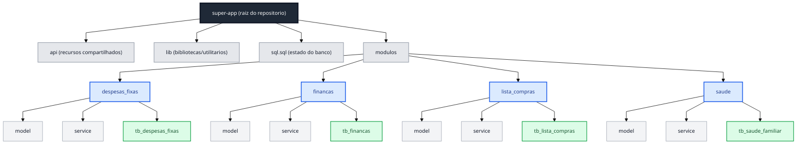

# Diagrama Informativo - Rastreabilidade de Pastas (Migracao aplicacoes ativas)

Este documento apresenta apenas a estrutura de pastas e o que existe em cada dominio, sem fluxo de processo.

---

## Diagrama Mermaid (estrutura)

---

## Legenda

| Elemento | Significado |
|---|---|
| `super-app` | Pasta raiz do repositorio. |
| `api`, `lib`, `modulos`, `sql.sql` | Estrutura e arquivo único de DDL (alterações de banco atualizam sql.sql). |
| `modulos/despesas_fixas`, `modulos/financas`, `modulos/lista_compras`, `modulos/saude` | Aplicativos (dominios) dentro de `modulos`. |
| `model` | Estruturas/modelos de dados do dominio. |
| `service` | Regras de servico e acesso por dominio. |
| `tb_*` | Tabela Supabase relacionada ao dominio. |

---

## Mapeamento dominio -> conteudo

| Dominio (em `modulos/`) | Subpastas | Tabela Supabase |
|---|---|---|
| `despesas_fixas` | `model`, `service` | `tb_despesas_fixas` |
| `financas` | `model`, `service` | `tb_financas` |
| `lista_compras` | `model`, `service` | `tb_lista_compras` |
| `saude` | `model`, `service` | `tb_saude_familiar` |

---

Diagrama ajustado para visao informativa de estrutura, sem etapas de processo.
