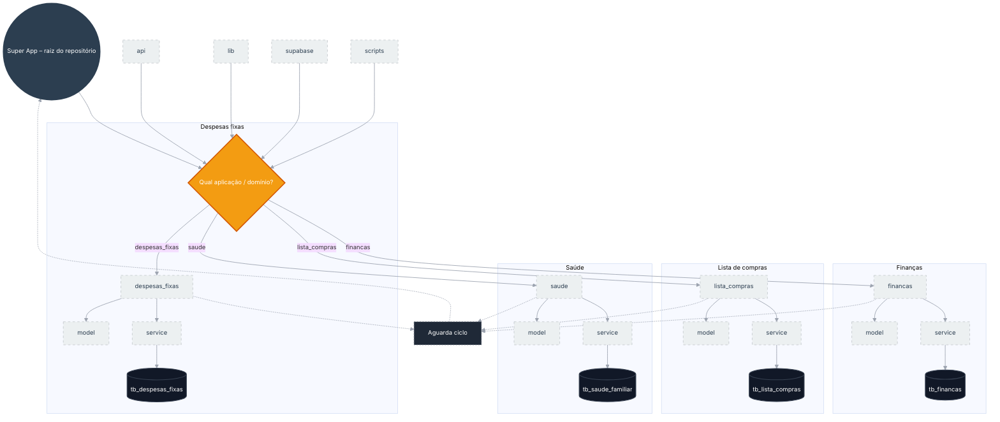

# Fluxograma – Rastreabilidade da separação de pastas (Migração aplicações ativas)

Documento de rastreabilidade da estrutura de pastas do Super App, seguindo o padrão Command Center Maestro (flowchart TD, blocos INIT/RAIZ/CICLOS/LOOP).

---

## Diagrama Mermaid

---

## Legenda

| Elemento        | Significado                                      |
|----------------|---------------------------------------------------|
| **Super App (raiz)** | Orquestrador / raiz do repositório (classe mestre). |
| **api, lib, supabase, scripts** | Pastas compartilhadas; entrada comum à decisão.   |
| **Decisão**    | Roteamento por aplicação/domínio (despesas_fixas, financas, lista_compras, saude). |
| **Subgraphs**  | Ciclos por aplicação ativa; cada um com pasta raiz → model, service → DB. |
| **Pastas**     | Diretórios (classe pasta).                        |
| **DB**         | Tabelas Supabase correspondentes (classe db).     |
| **Aguarda ciclo** | Retorno para rastreabilidade/loop (classe loop). |

---

## Mapeamento pastas → tabelas (rastreabilidade)

| Pasta aplicação   | model | service | Tabela Supabase    |
|-------------------|-------|---------|--------------------|
| despesas_fixas    | sim   | sim     | tb_despesas_fixas  |
| financas          | sim   | sim     | tb_financas        |
| lista_compras     | sim   | sim     | tb_lista_compras   |
| saude             | sim   | sim     | tb_saude_familiar  |

---

*Fluxograma gerado conforme padrão Command_Fluxograma (flowchart TD, INIT/RAIZ/CICLOS/LOOP, classes visuais).*
