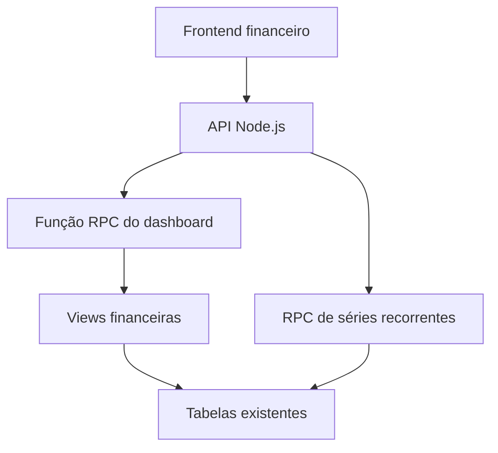

# Plano de Migração dos Cálculos Financeiros para o PostgreSQL

## 1. Objetivo

Reduzir o processamento executado pelas funções Node.js do módulo financeiro, transferindo para o PostgreSQL/Supabase os cálculos agregados, rankings, consolidações mensais e operações transacionais de séries recorrentes.

O Node.js deverá permanecer responsável por:

- autenticação e autorização da requisição;
- validação e normalização dos dados de entrada;
- escolha do caso de uso;
- chamada das funções RPC e views do banco;
- classificação textual e modelo Naive Bayes, inicialmente;
- montagem da resposta HTTP e tratamento de erros.

O PostgreSQL deverá assumir:

- somatórios financeiros;
- agrupamentos por mês e categoria;
- cálculo do saldo;
- valores pagos e pendentes;
- percentuais e rankings anuais;
- consolidação de poupança, metas e compras;
- criação, alteração e exclusão transacional de séries recorrentes.

## 2. Situação atual

O endpoint `/api/financeiro` consulta diferentes tabelas do Supabase e transfere os registros para o Node.js. Em seguida, o Node executa vários `filter`, `map`, `reduce`, ordenações e agrupamentos.

As principais funções envolvidas são:

- `calcularDashboard`;
- `calcularGraficos`;
- `calcularGraficosAnuais`;
- `filtrarFinancasPorMes`;
- `classificarFinancas`;
- `calcularAnaliseRiscoConsumo`;
- `detectarPadroesEInconsistencias`;
- cálculos adicionais em `api/financeiro-analista.js`.

Também existem sete grupos de consultas durante o carregamento completo:

1. finanças do mês;
2. finanças do ano;
3. despesas fixas do mês;
4. despesas fixas do ano;
5. histórico de poupança;
6. meta ativa;
7. compras do mês.

## 3. Problemas identificados

### 3.1 Processamento repetido

Os mesmos registros são percorridos várias vezes para produzir dashboard, gráficos, tabelas e análise anual.

### 3.2 Transferência excessiva de dados

O Supabase devolve registros individuais quando a interface precisa principalmente de valores consolidados.

### 3.3 Divergência de contratos

O dashboard retorna:

- `liquido`;
- `despesas_variadas`.

O analista financeiro tenta consumir:

- `saldo`;
- `despesas_variaveis`;
- `despesas_totais`.

Esses nomes devem ser padronizados antes da migração.

### 3.4 Indicadores incorretos ou provisórios

- `top_categoria` está fixado como `Alimentação` no histórico mensal.
- `categorias_ano` reutiliza as categorias do mês selecionado.
- totais anuais são recalculados no Node mesmo podendo ser agrupados diretamente no banco.

### 3.5 Operações recorrentes não transacionais

A exclusão de uma despesa e a limpeza dos registros futuros são operações separadas. Uma falha intermediária pode deixar a série parcialmente alterada.

## 4. Arquitetura-alvo



Fluxo esperado:

1. O frontend solicita um mês.
2. O Node valida o formato `YYYY-MM` e identifica o usuário.
3. O Node chama uma função RPC no Supabase.
4. O PostgreSQL agrega os dados e devolve um JSON consolidado.
5. O Node somente adapta a resposta para o contrato da API.

## 5. Objetos de banco necessários

### 5.1 View `vw_financeiro_resumo_mensal`

Responsável por consolidar uma linha por usuário e competência.

Campos previstos:

- `user_id`;
- `mes_ano`;
- `receitas`;
- `despesas_fixas`;
- `despesas_variadas`;
- `despesas_totais`;
- `saldo`;
- `fixas_pagas`;
- `fixas_pendentes`.

Substitui os cálculos atuais de dashboard e parte dos gráficos.

### 5.2 View `vw_financeiro_categoria_mensal`

Responsável pelos gastos agrupados por categoria.

Campos previstos:

- `user_id`;
- `mes_ano`;
- `categoria`;
- `valor_total`;
- `quantidade_lancamentos`;
- `media_lancamento`;
- `ranking_maior`;
- `ranking_menor`.

Substitui agrupamentos e ordenações por categoria executados no JavaScript.

### 5.3 View `vw_financeiro_historico_anual`

Responsável pelos indicadores mensais utilizados pelo analista.

Campos previstos:

- `user_id`;
- `ano`;
- `mes_ano`;
- `receitas`;
- `despesas_fixas`;
- `despesas_variadas`;
- `despesas_totais`;
- `saldo`;
- `percentual_comprometido`;
- `ranking_melhor_saldo`;
- `ranking_pior_saldo`;
- `ranking_maior_fixa`;
- `ranking_maior_variada`.

### 5.4 View `vw_financeiro_poupanca_resumo`

Responsável por consolidar:

- total acumulado;
- meta ativa;
- valor da meta;
- percentual de progresso;
- situação da meta.

### 5.5 View `vw_financeiro_compras_mensal`

Responsável por consolidar compras por usuário e mês.

Campos previstos:

- `user_id`;
- `mes_ano`;
- `valor_total`;
- `quantidade_compras`;
- `ticket_medio`.

### 5.6 Função `fn_financeiro_dashboard`

Parâmetros:

- `p_mes_ano text`.

O usuário deverá ser obtido por `auth.uid()` no próprio banco, evitando aceitar um `user_id` arbitrário enviado pelo cliente.

Retorno JSON previsto:

```json
{
  "mes_ano": "2026-08",
  "dashboard": {},
  "categorias_mes": [],
  "historico_anual": [],
  "poupanca": {},
  "compras": {}
}
```

### 5.7 Funções transacionais para séries

Criar:

- `fn_criar_despesa_recorrente`;
- `fn_atualizar_serie_financeira`;
- `fn_excluir_serie_financeira`.

As funções devem trabalhar com `serie_id` e executar toda a operação na mesma transação.

Escopos necessários para atualização e exclusão:

- somente o registro selecionado;
- registro selecionado e futuros;
- série completa.

## 6. Estratégia de migração dos dados atuais

As views não armazenam cópias. Portanto, os registros existentes em:

- `tb_financas`;
- `tb_despesas_fixas`;
- `tb_poupanca`;
- `tb_poupanca_metas`;
- `tb_compras`;

passarão a ser calculados automaticamente pelas views. Não será necessário copiar os lançamentos para novas tabelas.

### 6.1 Preparação

1. Fazer backup lógico das tabelas financeiras.
2. Conferir se todas possuem `user_id`.
3. Confirmar RLS habilitada e políticas por usuário.
4. Conferir os tipos de `created_at`, `data_lancamento`, `valor` e `serie_id`.
5. Levantar registros antigos sem `user_id` ou com datas inválidas.

### 6.2 Saneamento

Executar relatórios antes de qualquer correção:

- lançamentos sem usuário;
- valores nulos;
- competências inválidas;
- parcelas com `parcela_atual > parcela_total`;
- contas marcadas simultaneamente como fixas e parceladas;
- séries com mais de um `serie_id`;
- séries antigas sem `serie_id`.

Não preencher `serie_id` antigo apenas pela descrição sem revisão. Duas contas diferentes podem possuir descrições iguais.

### 6.3 Backfill de `serie_id`

Aplicar somente a séries cuja relação seja determinística:

- parcelas com mesma descrição normalizada, mesmo total e sequência mensal contínua;
- contas fixas com mesma descrição, valor compatível e sequência mensal contínua;
- sempre dentro do mesmo `user_id`.

Registros ambíguos devem permanecer sem backfill automático e ser tratados manualmente.

### 6.4 Validação de paridade

Durante a transição, comparar para cada usuário e mês:

- resultado calculado pelo Node;
- resultado retornado pelas views;
- diferença absoluta;
- quantidade de lançamentos considerada.

Critério de aprovação: diferença monetária igual a zero após arredondamento para duas casas decimais.

## 7. Alterações no Node.js

### 7.1 Primeira etapa

Manter o endpoint atual e acrescentar uma execução paralela da nova RPC apenas para comparação, sem alterar a resposta entregue ao frontend.

Registrar somente:

- competência;
- indicador divergente;
- valor antigo;
- valor novo;
- diferença.

Não registrar descrições ou payloads financeiros completos.

### 7.2 Segunda etapa

Substituir no fluxo principal:

- `calcularDashboard`;
- `calcularGraficos`;
- `calcularGraficosAnuais`;
- cálculos anuais de `api/financeiro-analista.js`.

O Node passará a consumir `fn_financeiro_dashboard`.

### 7.3 Terceira etapa

Migrar criação, atualização e exclusão de despesas recorrentes para as funções transacionais.

### 7.4 Código que permanece no Node

- `payloadInsertFinanceiro` e `payloadUpdateFinanceiro` como validação de entrada;
- normalização de categorias;
- modelo Naive Bayes;
- heurísticas textuais;
- tratamento HTTP;
- compatibilidade temporária com o contrato antigo.

## 8. Padronização do contrato

Adotar definitivamente:

```text
receitas
despesas_fixas
despesas_variadas
despesas_totais
saldo
```

Remover gradualmente os nomes:

```text
liquido
despesas_variaveis
```

Durante uma versão de transição, a API poderá devolver aliases para evitar quebra do frontend.

## 9. Índices recomendados

Avaliar e criar índices compostos para:

- `tb_financas (user_id, data_lancamento)`;
- `tb_financas (user_id, tipo, data_lancamento)`;
- `tb_financas (user_id, categoria, data_lancamento)`;
- `tb_despesas_fixas (user_id, created_at)`;
- `tb_despesas_fixas (user_id, serie_id, created_at)`;
- `tb_despesas_fixas (user_id, status, created_at)`;
- `tb_poupanca (user_id, data_lancamento)`;
- `tb_poupanca_metas (user_id, ativa)`;
- `tb_compras (user_id, data_lancamento)`.

Os índices devem ser criados após confirmar os nomes e tipos reais das colunas.

## 10. Segurança e LGPD

- Manter RLS habilitada em todas as tabelas financeiras.
- Usar `security_invoker` nas views quando suportado pela versão do PostgreSQL.
- Evitar funções `SECURITY DEFINER`; quando inevitável, fixar `search_path` e validar `auth.uid()`.
- Não aceitar `user_id` informado livremente pelo frontend.
- Não registrar descrições, valores detalhados ou respostas completas em logs técnicos.
- Restringir `service_role` às rotinas administrativas que realmente necessitem dela.
- Conceder acesso às views e funções somente à role `authenticated`.

## 11. Testes obrigatórios

### 11.1 Consolidação

- mês sem registros;
- mês somente com receitas;
- mês somente com despesas;
- receitas e despesas no mesmo mês;
- categorias com e sem acento;
- lançamento na virada do fuso horário;
- consulta de dezembro e janeiro.

### 11.2 Recorrência

- conta fixa criada no meio do ano;
- parcela atravessando dezembro;
- exclusão somente do mês;
- exclusão do mês e futuros;
- exclusão da série completa;
- alteração de valor somente a partir do mês escolhido;
- rollback integral quando qualquer operação falhar.

### 11.3 Segurança

- usuário não visualiza registros de outro usuário;
- RPC ignora tentativa de informar outro `user_id`;
- usuário anônimo não acessa dados financeiros;
- views respeitam as políticas RLS das tabelas-base.

### 11.4 Performance

Comparar antes e depois:

- tempo total do endpoint;
- número de consultas ao Supabase;
- quantidade de bytes retornados pelo banco;
- memória consumida pela função Node;
- tempo de execução da RPC;
- plano gerado por `EXPLAIN (ANALYZE, BUFFERS)`.

## 12. Implantação por fases

### Fase 1 — Correção e preparação

- padronizar nomes do contrato;
- corrigir `top_categoria` fixo;
- corrigir `categorias_ano`;
- validar schema e RLS;
- criar índices necessários.

### Fase 2 — Views

- criar views mensais;
- criar histórico anual;
- validar paridade com o Node.

### Fase 3 — RPC do dashboard

- criar função consolidada;
- executar em modo de comparação;
- medir desempenho.

### Fase 4 — Troca do fluxo de leitura

- alterar `/api/financeiro`;
- alterar `/api/financeiro-analista`;
- manter fallback temporário.

### Fase 5 — Recorrência transacional

- criar RPCs de série;
- migrar criação, atualização e exclusão;
- testar rollback e concorrência.

### Fase 6 — Limpeza

- remover cálculos Node sem uso;
- remover consultas redundantes;
- atualizar documentação e testes;
- retirar o fallback após período estável.

## 13. Estratégia de rollback

- Não remover imediatamente as funções JavaScript antigas.
- Controlar o novo fluxo por variável de ambiente ou feature flag.
- Em caso de divergência, retornar temporariamente ao cálculo Node.
- Views podem ser removidas sem afetar as tabelas-base.
- Alterações de séries devem possuir backup anterior à ativação das RPCs.

## 14. Critérios de conclusão

A migração será considerada concluída quando:

- os valores do banco e do cálculo antigo forem idênticos;
- o endpoint principal usar uma RPC consolidada;
- o analista não recalcular o histórico no Node;
- operações de séries forem atômicas;
- RLS estiver validada;
- testes de virada de mês e ano estiverem aprovados;
- métricas demonstrarem redução de tráfego e processamento;
- o contrato financeiro estiver padronizado.

## 15. Resultado esperado

Estimativa: entre 70% e 80% dos cálculos atuais do módulo financeiro podem ser removidos do Node.js.

O resultado será:

- menos processamento nas funções serverless;
- menor transferência de dados;
- dashboard mais rápido;
- cálculos consistentes entre telas;
- exclusões recorrentes seguras;
- banco utilizado como fonte única das regras agregadas;
- manutenção mais simples do módulo financeiro.
